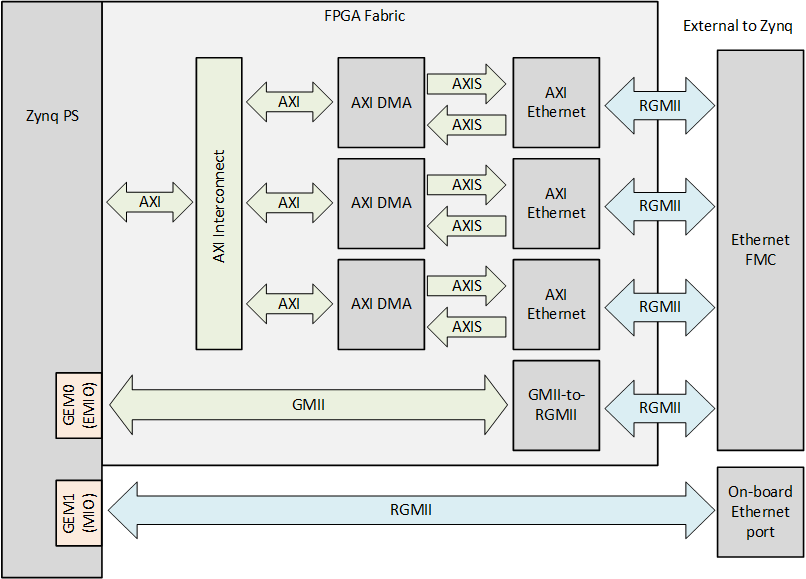
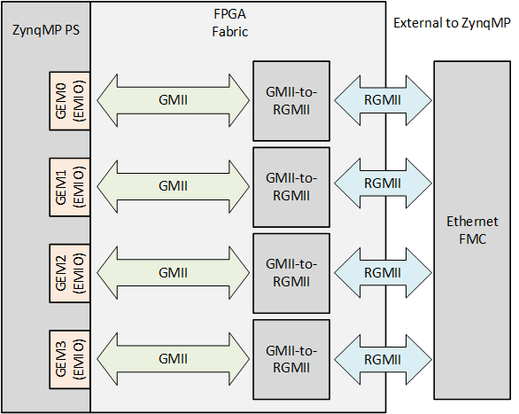

# Zynq GEM Reference Designs for Ethernet FMC

## Description

This project demonstrates the use of the Opsero [Ethernet FMC] (OP031) and [Robust Ethernet FMC] (OP041).
The design uses the GMII-to-RGMII IP core to connect the hard GEMs of the Zynq PS to the Ethernet FMC
PHYs. The designs target both the Zynq and ZynqMP devices and are illustrated by the block diagrams below.

### Zynq Design



### ZynqMP Design



Important links:

* Datasheets for [Ethernet FMC] and [Robust Ethernet FMC]
* The user guide for these reference designs is hosted here: [Zynq GEM for Ethernet FMC docs](https://zynqgem.ethernetfmc.com "Zynq GEM for Ethernet FMC docs")
* To report a bug: [Report an issue](https://github.com/fpgadeveloper/ethernet-fmc-zynq-gem/issues "Report an issue").
* For technical support: [Contact Opsero](https://opsero.com/contact-us "Contact Opsero").
* To purchase the mezzanine card: [Ethernet FMC order page](https://opsero.com/product/ethernet-fmc "Ethernet FMC order page").

## Requirements

This project is designed for version 2024.1 of the Xilinx tools (Vivado/Vitis/PetaLinux). 
If you are using an older version of the Xilinx tools, then refer to the 
[release tags](https://github.com/fpgadeveloper/ethernet-fmc-zynq-gem/tags "releases")
to find the version of this repository that matches your version of the tools.

In order to test this design on hardware, you will need the following:

* Vivado 2024.1
* Vitis 2024.1
* PetaLinux Tools 2024.1
* [Ethernet FMC] or [Robust Ethernet FMC]
* One of the target platforms listed below
* For designs containing AXI Ethernet Subsystem IP: [Xilinx Soft TEMAC license](http://ethernetfmc.com/getting-a-license-for-the-xilinx-tri-mode-ethernet-mac/ "Xilinx Soft TEMAC license")

## Target designs

This repo contains several designs that target various supported development boards and their
FMC connectors. The table below lists the target design name, the number of ports supported by the design and 
the FMC connector on which to connect the mezzanine card. Some of the target designs
require a license to generate a bitstream with the AMD Xilinx tools.

<!-- updater start -->
### Zynq-7000 designs

| Target board          | Target design      | Ports       | FMC Slot(s) | Standalone<br> Echo Server | PetaLinux | Vivado<br> Edition |
|-----------------------|--------------------|-------------|-------------|-------|-------|-------|
| [PicoZed 7030]        | `pz_7030`          | 4x          | LPC         | :white_check_mark: | :white_check_mark: | Standard :free: |
| [ZC706]               | `zc706_lpc`        | 4x          | LPC         | :white_check_mark: | :white_check_mark: | Enterprise |
| [ZedBoard]            | `zedboard`         | 4x          | LPC         | :white_check_mark: | :white_check_mark: | Standard :free: |

### Zynq UltraScale+ designs

| Target board          | Target design      | Ports       | FMC Slot(s) | Standalone<br> Echo Server | PetaLinux | Vivado<br> Edition |
|-----------------------|--------------------|-------------|-------------|-------|-------|-------|
| [PYNQ-ZU]             | `pynqzu`           | 4x          | LPC         | :white_check_mark: | :white_check_mark: | Standard :free: |
| [UltraZed-EG PCIe Carrier] | `uzeg_pci`         | 4x          | LPC         | :white_check_mark: | :white_check_mark: | Standard :free: |
| [UltraZed-EV Carrier] | `uzev`             | 4x          | HPC         | :white_check_mark: | :white_check_mark: | Standard :free: |
| [ZCU102]              | `zcu102_hpc0`      | 4x          | HPC0        | :white_check_mark: | :white_check_mark: | Enterprise |
| [ZCU102]              | `zcu102_hpc1`      | 3x          | HPC1        | :white_check_mark: | :white_check_mark: | Enterprise |
| [ZCU104]              | `zcu104`           | 4x          | LPC         | :white_check_mark: | :white_check_mark: | Standard :free: |
| [ZCU106]              | `zcu106_hpc0`      | 4x          | HPC0        | :white_check_mark: | :white_check_mark: | Standard :free: |
| [ZCU111]              | `zcu111`           | 4x          | FMCP        | :white_check_mark: | :white_check_mark: | Enterprise |
| [ZCU208]              | `zcu208`           | 4x          | FMCP        | :white_check_mark: | :white_check_mark: | Enterprise |

[PicoZed 7030]: https://www.xilinx.com/products/boards-and-kits/1-hypn9d.html
[ZC706]: https://www.xilinx.com/zc706
[ZedBoard]: https://www.xilinx.com/products/boards-and-kits/1-8dyf-11.html
[PYNQ-ZU]: https://www.amd.com/en/corporate/university-program/aup-boards/pynq-zu.html
[UltraZed-EG PCIe Carrier]: https://www.xilinx.com/products/boards-and-kits/1-mb9rqb.html
[UltraZed-EV Carrier]: https://www.xilinx.com/products/boards-and-kits/1-1s78dxb.html
[ZCU102]: https://www.xilinx.com/zcu102
[ZCU104]: https://www.xilinx.com/zcu104
[ZCU106]: https://www.xilinx.com/zcu106
[ZCU111]: https://www.xilinx.com/zcu111
[ZCU208]: https://www.xilinx.com/zcu208
<!-- updater end -->

## Software

These reference designs can be driven by either a standalone application or within a PetaLinux environment. 
The repository includes all necessary scripts and code to build both environments. The table 
below outlines the corresponding applications available in each environment:

| Environment      | Available Applications  |
|------------------|-------------------------|
| Standalone       | lwIP Echo Server |
| PetaLinux        | Built-in Linux commands<br>Additional tools: ethtool, phytool, iperf3 |

## Build instructions

Clone the repo:
```
git clone https://github.com/fpgadeveloper/ethernet-fmc-zynq-gem.git
```

Source Vivado and PetaLinux tools:

```
source <path-to-petalinux>/2024.1/settings.sh
source <path-to-vivado>/2024.1/settings64.sh
```

To build the standalone lwIP echo server application (Vivado project and Vitis workspace):

```
cd ethernet-fmc-zynq-gem/Vitis
make workspace TARGET=zcu106_hpc0
```

To build the PetaLinux image (Vivado project and PetaLinux):

```
cd ethernet-fmc-zynq-gem/PetaLinux
make petalinux TARGET=zcu106_hpc0
```

Replace the target label in these commands with the one corresponding to the target design of your
choice from the tables above.

## Contribute

We strongly encourage community contribution to these projects. Please make a pull request if you
would like to share your work:
* if you've spotted and fixed any issues
* if you've added designs for other target platforms

Thank you to everyone who supports us!

## About us

This project was developed by [Opsero Inc.](https://opsero.com "Opsero Inc."),
a tight-knit team of FPGA experts delivering FPGA products and design services to start-ups and tech companies. 
Follow our blog, [FPGA Developer](https://www.fpgadeveloper.com "FPGA Developer"), for news, tutorials and
updates on the awesome projects we work on.

[Ethernet FMC]: https://ethernetfmc.com/docs/ethernet-fmc/overview/
[Robust Ethernet FMC]: https://ethernetfmc.com/docs/robust-ethernet-fmc/overview/

