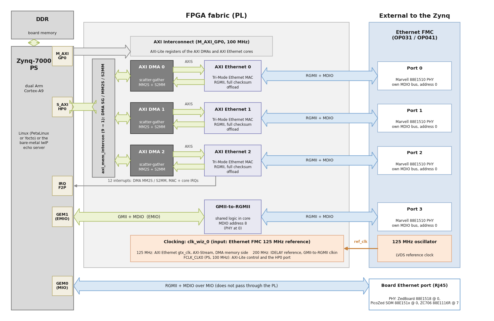
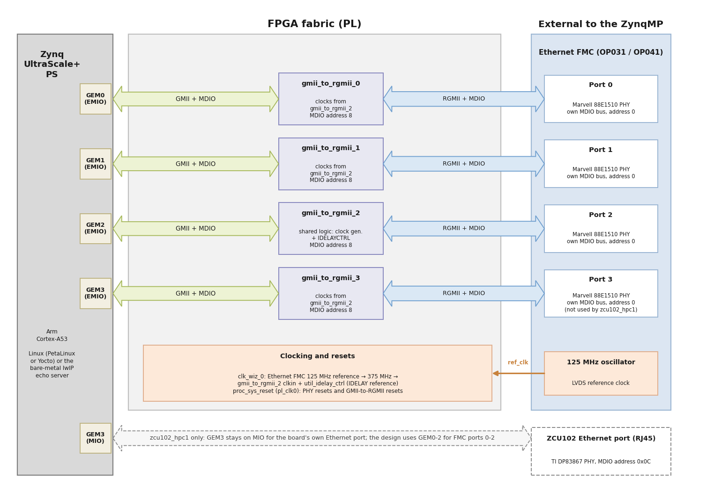

# Description

These reference designs connect the four Gigabit Ethernet ports of the Opsero
[Ethernet FMC] (OP031) or [Robust Ethernet FMC] (OP041) to the **hard Ethernet MACs (GEMs)
of the Zynq processing system**. A GEM normally drives its PHY through the PS multiplexed I/O
(MIO); here the GEMs are routed through the FPGA fabric (EMIO), where a GMII-to-RGMII IP core
converts each GEM's GMII interface into the RGMII interface of an Ethernet FMC PHY. The designs
target Zynq-7000, Zynq UltraScale+ MPSoC and Zynq UltraScale+ RFSoC boards.

The Zynq-7000 has only two GEMs, so on that family three of the FMC ports use the soft AXI
Ethernet Subsystem instead (see below). The Zynq UltraScale+ has four GEMs, one per FMC port.

## Zynq-7000 designs



Targets: ZedBoard (`zedboard`), PicoZed 7030 on the PicoZed FMC Carrier Card V2 (`pz_7030`)
and ZC706 (`zc706_lpc`).

* **FMC ports 0, 1 and 2** each use an AXI Ethernet Subsystem core (Tri-Mode Ethernet MAC with
  an RGMII interface and full checksum offload) and a scatter-gather AXI DMA. The DMAs reach the
  DDR memory through an AXI interconnect and the PS `S_AXI_HP0` port; the PS reaches the
  registers of the DMAs and MACs through `M_AXI_GP0`. Each core has its own MDIO bus to its PHY.
* **FMC port 3** uses the PS **GEM1**, routed to the fabric over EMIO and converted to RGMII by
  a GMII-to-RGMII core. The GMII-to-RGMII core sits on GEM1's MDIO bus at address 8; the PHY is at
  address 0.
* **The board's own Ethernet port** is wired to the PS **GEM0** through MIO and does not pass
  through the FPGA fabric. It is enabled in the Linux images of this repository (PetaLinux and
  Yocto), so a Zynq-7000 board has five Ethernet ports under Linux: four on the Ethernet FMC and
  the board's RJ45.
* **Clocking.** The 125 MHz reference clock of the Ethernet FMC feeds a clock wizard that makes
  125 MHz (AXI Ethernet transmit clock, AXI-Stream and DMA memory side) and 200 MHz (IDELAY
  reference and GMII-to-RGMII clock input). The AXI-Lite control interfaces run on the PS
  `FCLK_CLK0` (100 MHz).

```{note}
The AXI Ethernet Subsystem uses the Tri-Mode Ethernet MAC, which needs an IP license to
generate a bitstream (an evaluation license is available from AMD). See
[Requirements](requirements.md).
```

## Zynq UltraScale+ designs



Targets: PYNQ-ZU, UltraZed-EG PCIe Carrier, UltraZed-EV Carrier, ZCU102 (HPC0 and HPC1),
ZCU104, ZCU106 (HPC0), ZCU111 and ZCU208.

* **FMC ports 0 to 3** use the PS **GEM0 to GEM3** over EMIO, one GMII-to-RGMII core per port.
  The third GMII-to-RGMII core (`gmii_to_rgmii_2`) contains the shared logic: it generates the
  GMII clocks for all four cores and holds the IDELAYCTRL. Each GEM has its own MDIO bus, with the
  GMII-to-RGMII core at address 8 and the Ethernet FMC PHY at address 0.
* **Clocking.** A clock wizard makes 375 MHz from the Ethernet FMC's 125 MHz reference clock;
  it drives the shared logic and the IDELAY reference.
* **The board's own Ethernet port** is normally wired to GEM3. Since these designs use all four
  GEMs for the Ethernet FMC, the board's port is not available in these designs, with one
  exception:
* **`zcu102_hpc1`** uses only GEM0 to GEM2, for FMC ports 0 to 2. FMC port 3 is not supported on
  the ZCU102's HPC1 connector, because some of the FMC pins it needs (LA30, LA31 and LA32) are not
  connected on that connector. GEM3 therefore stays on MIO and drives the ZCU102's own Ethernet
  port (TI DP83867 PHY at MDIO address 0x0C), which is available under Linux.

## Ports, MACs and PHYs

The table below lists what each Ethernet port is connected to and the MAC address that the
Linux images give it. The MAC addresses are set in the device tree (see [Advanced](advanced.md));
they are the easiest way to tell the ports apart in Linux, because the Linux interface names do
not follow the FMC port numbers (see [Using and testing the ports](testing.md#interface-names)).

| Port | Zynq-7000 | Zynq UltraScale+ | PHY (MDIO address) | MAC address |
|------|-----------|------------------|--------------------|-------------|
| Ethernet FMC port 0 | AXI Ethernet 0 | GEM0 | Marvell 88E1510 (0) | `00:0a:35:00:01:22` |
| Ethernet FMC port 1 | AXI Ethernet 1 | GEM1 | Marvell 88E1510 (0) | `00:0a:35:00:01:23` |
| Ethernet FMC port 2 | AXI Ethernet 2 | GEM2 | Marvell 88E1510 (0) | `00:0a:35:00:01:24` |
| Ethernet FMC port 3 | GEM1 | GEM3 (not on `zcu102_hpc1`) | Marvell 88E1510 (0) | `00:0a:35:00:01:25` |
| Board Ethernet port | GEM0 | GEM3 on `zcu102_hpc1` only | board PHY (see below) | Zynq-7000: `00:0a:35:00:01:26`<br>`zcu102_hpc1`: `00:0a:35:00:01:25` |

Board PHYs: ZedBoard Marvell 88E1518 at address 0, PicoZed SOM Marvell 88E151x at address 0,
ZC706 Marvell 88E1116R at address 7, ZCU102 TI DP83867 at address 0x0C.

## Hardware platforms

The hardware designs provided in this reference are based on Vivado and support a range of
evaluation boards. The repository contains all necessary scripts and code to build these designs
for the supported platforms listed below:


    
    
        
            
        
    
    
### {{ group.name }} platforms

| Target board        | FMC Slot Used | Supported<br>Num. Ports   | Standalone<br> Echo Server | PetaLinux | Yocto |
|---------------------|---------------|---------|-----|-----|-----|
| [{{ design.board }}]({{ design.link }}) | {{ design.connector }} | {{ design.lanes | length }}x |  ✅  ❌  |  ✅  ❌  |  ✅  ❌  |




## Software

These reference designs can be driven by a standalone (bare-metal) application or by embedded
Linux, built with either PetaLinux or Yocto (the AMD Embedded Development Framework, EDF). The
repository includes all necessary scripts and code to build all three. The table below lists what
each environment provides:

| Environment | Available applications |
|-------------|------------------------|
| Standalone  | lwIP echo server, one Ethernet FMC port at a time ([Stand-alone lwIP Echo Server](echo_server.md)) |
| PetaLinux   | Built-in Linux commands<br>Additional tools: ethtool, phytool, iperf3 ([PetaLinux](petalinux.md)) |
| Yocto       | Built-in Linux commands (including `ip`)<br>Additional tools: ethtool, phytool, iperf3, bridge-utils (Zynq-7000)<br>PYNQ-ZU: on-board Wi-Fi with wpa_supplicant and `wifi-sta-setup` ([Yocto](yocto.md)) |

[Ethernet FMC]: https://docs.opsero.com/op031/datasheet/overview/
[Robust Ethernet FMC]: https://docs.opsero.com/op041/datasheet/overview/
