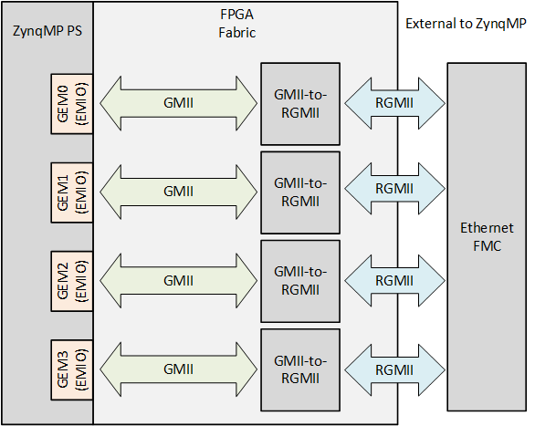

# Description

The reference designs target Zynq-7000, Zynq UltraScale+ MPSoC and Zynq UltraScale+ RFSoC 
boards.

## Zynq-7000 Designs

In the Zynq designs, the first three ports of the Ethernet FMC are connected to the
AXI Ethernet Subsystem IP which are then connected to the system memory via AXI DMA IP.
The fourth port of the Ethernet FMC is connected to the GMII-to-RGMII IP which
connects to hard GEM0 of the Zynq PS via the FPGA fabric (EMIO). The Ethernet port of
the Zynq development board (ie. the on-board Ethernet port) connects directly to the
hard GEM1 of the Zynq PS via MIO.

## Zynq US+ MPSoC and RFSoC Designs

In the Zynq UltraScale+ designs, all ports of the Ethernet FMC are connected to the GMII-to-RGMII IP
which connects to hard GEMs of the ZynqMP PS via the FPGA fabric (EMIO). The on-board
Ethernet port is left unconnected and is thus unusable in these reference designs.

